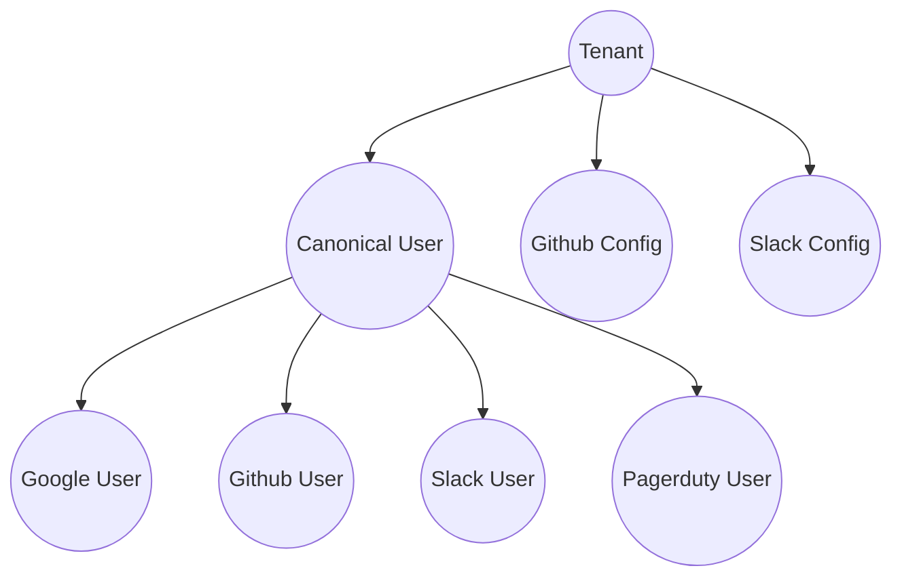

# Domain Model

## Tenants

Tenants describe a customer, business, or organization that uses Relatable.

### Product Configurations

Each tenant has one or more products associated with them where they are concerned
with managing accounts. A `Github` configuration node might include attributes like
`organizationName` and `teams`.

## CanonicalUser

A unique user, within the context of a single tenant, that is used to represent a person-in-the-world.

All accounts representing this user in one or more products (e.g. Github, Slack) will be associated
with a `CanonicalUser`.

Tenants should be able to choose how to initially identify `CanonicalUser`s.
For example, they may choose to specify Google Workspace as the source for identifying their
users canonically. Or they may choose to upload a CSV file with basic information about their users.
